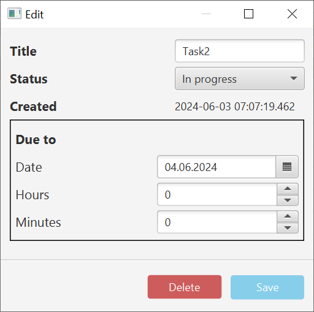

# "ToRead" app

- This simple project was made for Java2 2022/2023 course.

# Description

The ToDo app is a Java-based application built using JavaFX for managing your todo tasks. It allows users
to add, remove, and keep track of their to-do items. The application provides a simple and intuitive interface for task
management. Additionally, data are managed remotely via a Quarkus REST API, ensuring seamless and
efficient task synchronization and storage.

## Dependencies

- **Client**:
    - JavaFX
    - Log4j
    - Apache CXF RS Client
    - Jackson Jakarta RS JSON Provider

- **Server**:
    - Quarkus
    - Log4j
